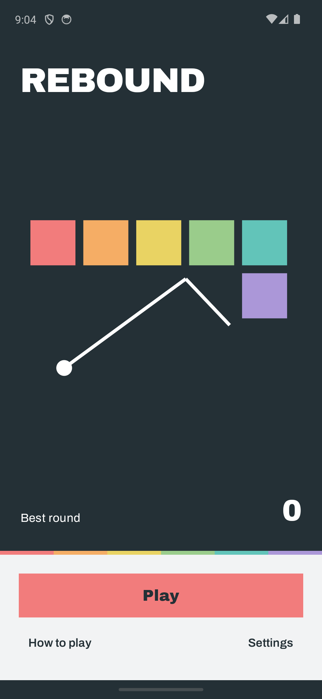
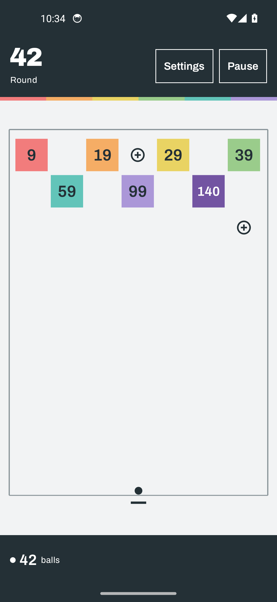

# Rebound

A clean, colorful ball-and-block game for Android. Aim a stream of balls, wear down numbered squares, collect extra balls, and keep the blocks above the bottom line.

**[Download the latest Android release](https://github.com/SeleniumEclipse/rebound/releases/latest)**

## Play

- Touch anywhere on the board and **pull back** to aim in the opposite direction; release to shoot. Pull down-left to shoot up-right. Taps do not shoot; return to the touch's starting point to cancel.
- The dotted guide only reaches about one-third of the board's height, leaving distant hit positions for you to judge.
- Each hit removes one from a block. At zero it disappears.
- Hit a **+ circle** to add a ball to the next volley.
- Blocks descend once the volley finishes. A block reaching the bottom ends the run.
- **Settings → Game speed** is a slider from 1× to 6×, adjustable in tenths and saved between games. Settings is available directly during play and from pause; gameplay waits while it is open.
- **Speed up** temporarily uses 6× until the current volley ends, then restores your chosen speed. It is not shown when your preferred speed is already 6×. **Collect** ends a long volley early, keeping damage and pickups already earned.
- The next-shot marker moves as soon as the first ball lands. Remaining balls in that volley still launch from the original position.
- Pause whenever needed. Your run, best round, and settings are saved on the device, including an interrupted volley.
- Block hits use **Bubble Pop**, a CC0 gum-bubble recording by Mafon2, rather than a synthesized tone. Closely spaced hit frames can overlap; there is no time-based sound cutoff. In **Settings**, turn Sound on and use **Test sound**; the phone's volume buttons adjust media volume. The app never raises system volume automatically.

No ads, accounts, tracking, or Internet connection. Requires **Android 8.0 or newer**. Portrait gameplay.

## Visual design

The multicolor board is built around a light field, square targets, readable numbers, and dark balls. The menus and score bands use bold Archivo Black lettering and the same coordinated spectrum. No gradients, glass, capsule controls, or filler slogans.

 

The board image is an Android test fixture used to show all the colors; new games start at round one with one ball. These are app screenshots, not web mockups.

## Build

Toolchain: JDK 17 or newer (tested with JDK 21), Android SDK 35, Gradle 8.11.1, AGP 8.7.3, Kotlin 2.0.21, Jetpack Compose.

Point `ANDROID_HOME` to your Android SDK, or create an ignored `local.properties` with `sdk.dir`. Then run:

```sh
./gradlew :app:assembleDebug :app:testDebugUnitTest :app:lintRelease
./gradlew :app:connectedDebugAndroidTest
```

On Windows, use `gradlew.bat` instead. The connected tests require an Android emulator or device; they reset **only the debug app's** preferences.

Release signing is optional for local builds and external to the repository:

```sh
./gradlew :app:assembleRelease -PsigningProperties=/private/keystore.properties
```

That file contains `storeFile`, `storePassword`, `keyAlias`, and `keyPassword`. Resolve the keystore path relative to that properties file. Never commit either file. Published APKs are release-signed; CI artifacts are debug builds, not public releases.

## Implementation

- Pure Kotlin, fixed-step simulation with continuous circle/rectangle collision detection and chronological shared-block impacts.
- Short radius-aware aiming hints, visible ceiling and walls flush with the outer block columns, capped visual effects, sequential volleys up to 999 balls, and deterministic random rows.
- Earlier saves are migrated to the tighter side walls without clearing progress. A ball stranded in a removed side lane is safely returned if moving it inward would overlap a block.
- Separate Compose interface, local versioned save snapshots, lifecycle pause, optional sound, vibration, and animation.
- For low vision, controls are labeled and keyboard/TalkBack aiming actions are available. The moving visual board is **not claimed to be fully playable without sight**.

See [VALIDATION.md](VALIDATION.md) for test evidence and limitations, [DESIGN.md](DESIGN.md) for design decisions, and [THIRD_PARTY.md](THIRD_PARTY.md) for credits.

Rebound is an original implementation inspired by the numbered-brick game genre. It is not affiliated with Ballz or Ketchapp.